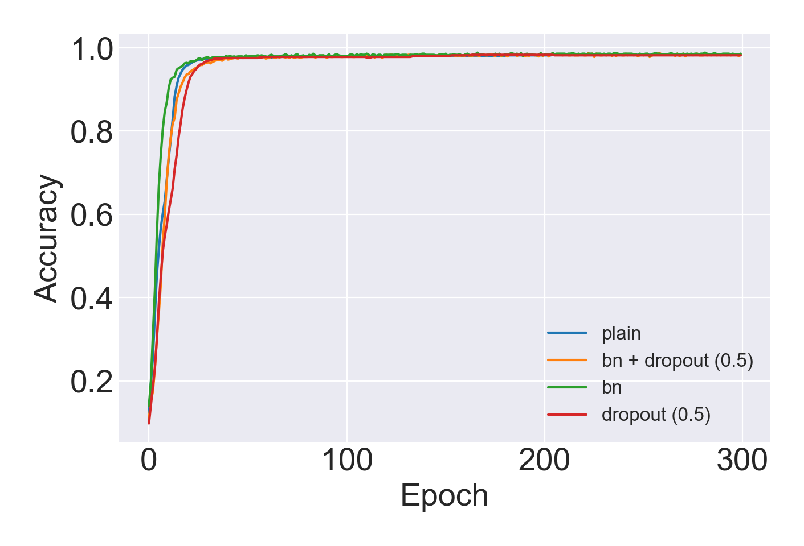

# StatLearning-Image-Classification

The code for the project of statistical learning (X033524).

## Requirements

* Python 3.x
* [numpy>=1.15.4](http://www.numpy.org/)
* [pytorch>=1.0.0](http://pytorch.org/)
* [sklearn>=0.19.2](http://scikit-learn.org/stable/index.html)
* [torchvision>=0.2.1](http://pytorch.org/) (if you want to use some DCNN architectures)

## Usage

* Change your current dictionary into the root dictionary of this project.

* Create `origin_data` directory and put the training data into it.

* Run the command:

`python3 main.py --method [knn, svm, mlp, cnn and etc] --mode [train or test]`

## Results

### Conventional Classification Approaches

| Model | Accuracy / % | Model | Accuracy / % |
| :---- |:------------:| :---- |:------------:|
| NULL Model | 8.92 | Naive Bayes (Gaussian) | 90.58 |
| Logistic Regression | **98.40** | Naive Bayes (Multinomial) | 97.37 |
| Decision Tree (gini) | 87.76 | Naive Bayes (Bernoulli) | 97.24 |
| Decision Tree (entropy) | 88.46 | LDA | 96.79 |
| KNN (1 neighbours) | 95.32 | KNN (3 neighbours) | 95.83 |
| KNN (5 neighbours) | 96.03 | KNN (10 neighbours) | 96.54 |

### SVM & NN

| Model | Accuracy / % | Model | Accuracy / % |
| :---- |:------------:| :---- |:------------:|
| SVM (rbf) | 98.78 | SVM (polynomial) | 95.32 |
| SVM (sigmoid) | 91.15 | Plain MLP | 98.33 |
| MLP + BN | **98.84** | MLP + Dropout (0.5) | 98.33 |
| MLP + BN + Dropout (0.5) | 98.72 | Naive CNN | 98.71 |
| DenseNet121 | 96.92 | PointNet | 98.74 |

The test curves of the above NN models:

<figure class="half">
    
    
</figure>

## Visualization of the input

I reshape 4096-dim vectors to 2d feature maps.

<figure class="half">
    
</figure>

## Tips

* In the training process, besides the best model and final model, I also save the model after several epoch. When you are testing, you should specific the model you want to use if you use `mlp` or `cnn` method (default model is the final one).

* The default CNN architecture is a naive CNN, you may change the architecture in `nn/main.py` and `nn/model.py` if you like.
